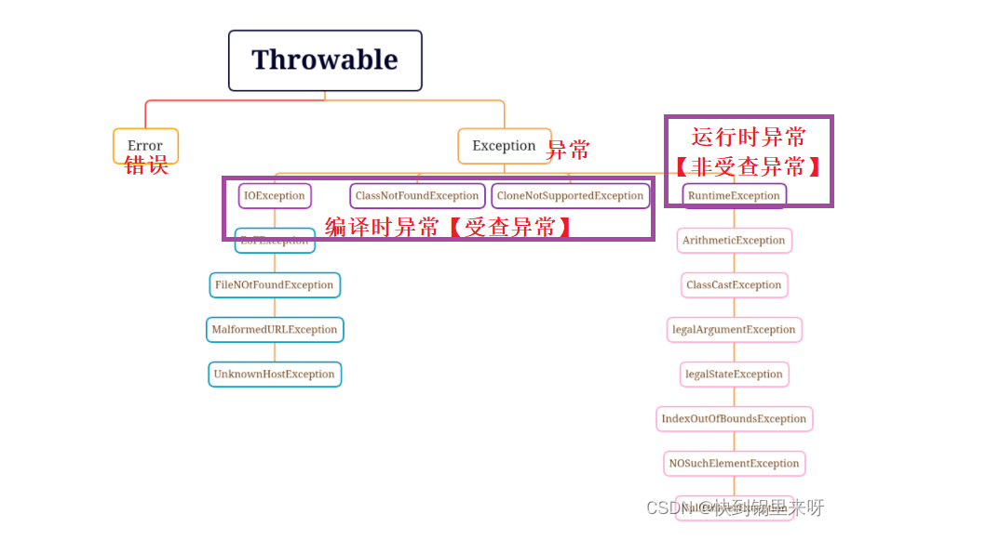
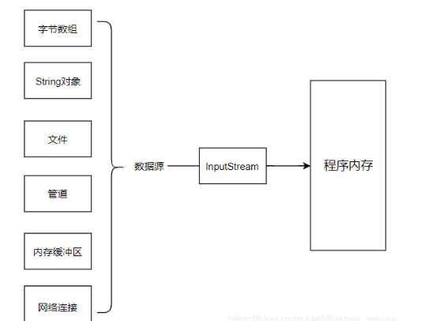
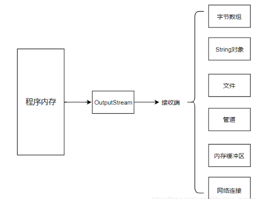
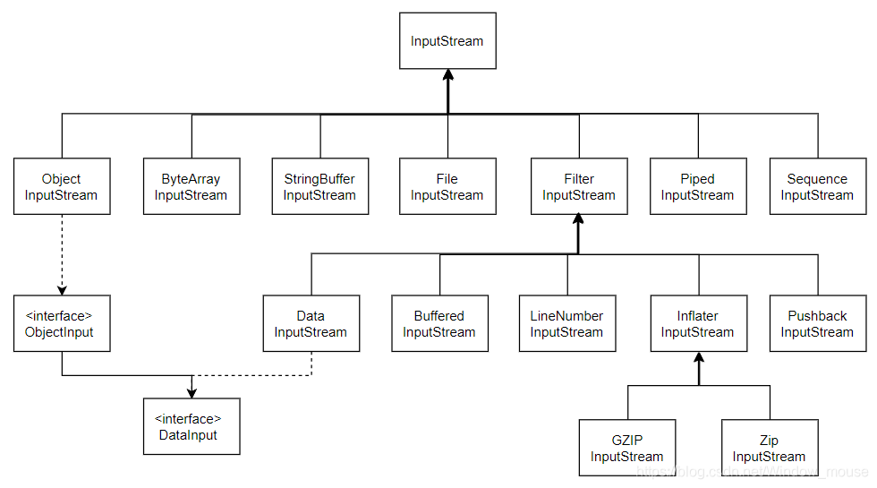
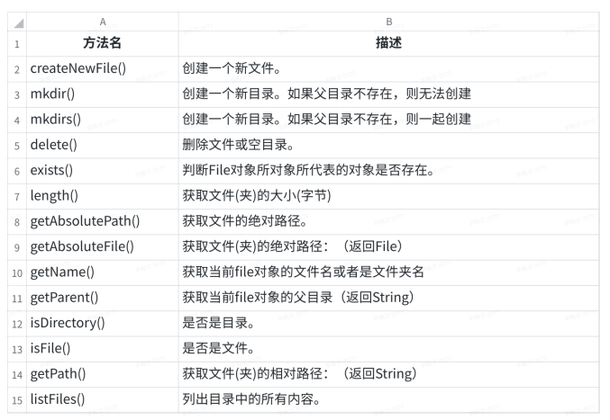

# JavaSE-异常、I/O流

# 异常

https://leixiaoheng.blog.csdn.net/article/details/125040373

程序在运⾏的过程出现的错误，称之为异常。如果异常不处理，那么就会终⽌java虚拟机的运⾏。意味着出现异常后⾯的代码就不会再执⾏了。

## JAVA的异常处理机制

如果某个方法不能按照正常的途径完成任务，就可以通过另一种路径退出方法。在这种情况下会抛出一个封装了错误信息的对象。此时，这个方法会立刻退出同时不返回任何值。另外，调用这个方法的其他代码也无法继续执行，异常处理机制会将代码执行交给异常处理器。

## 异常产生的原因

> **主要是有三种原因：**
>
> 1. 编写程序代码中的错误产生的异常，比如数组越界、空指针异常等，这种异常叫做未检查的异常，一般需要在类中处理这些异常
> 2. Java内部错误发生的异常，Java虚拟机产生异常
> 3. 通过throw（抛出异常）语句手动生成的异常，这种异常叫做检查的异常，一般是用来给方法调用者一些必要的信息

## 异常分类

Throwable(异常的父类)

 （1）Throwable：是异常体系的顶层类，其派生出两个重要的子类, Error 和 Exception而 Error 和 Exception 两子类分别表示错误和异常。

区别就是不检查异常（Unchecked Exception）和检查异常（Checked Exception）。

（2）Exception 类用于用户程序可能出现的异常情况，它也是用来创建自定义异常类型类的类。

> **指异常产生后程序员可以通过代码进行处理，使程序继续执行。**

（3）Error 定义了在通常环境下不希望被程序捕获的异常。Error 类型的异常用于 Java 运行时由系统显示与运行时系统本身有关的错误。堆栈溢出是这种错误的一例。

> **指的是Java虚拟机无法解决的严重问题，比如：JVM的内部错误、资源耗尽等，典型代表：StackOverflowError和OutOfMemoryError，一旦发生回力乏术**。

**异常可能在编译时发生，也有可能在程序运行时发生，根据发生时机不同，可以分为：**

> **运行时异常**：都是 RuntimeException 类及其子类异常，如 NullPointerException、IndexOutOfBoundsException 等，这些异常是不检查异常，程序中可以选择捕获处理，也可以不处理。这些异常一般由程序逻辑错误引起，程序应该从逻辑角度尽可能避免这类异常的发生。
>
> > RuntimeException 不受检测异常（不太严重的问题），就算是有这种发生问题的可能性，既不要try-catch，也不需要throws
>
> **编译时异常**：是指 RuntimeException 以外的异常，类型上都属于 Exception 类及其子类。从程序语法角度讲是必须进行处理的异常，如果不处理，程序就不能编译通过。如 IOException、ClassNotFoundException 等以及用户自定义的 Exception 异常，一般情况下不自定义检查异常。
>
> > 非RuntimeException的子类 受检测异常（较为严重的问题），编译器强制要求开发人员面对这个问题：1、自己来处理，编写try-catch。2、自己不处理，在方法上添加throws XxxException，它的用意是告诉调用这个方法的人，这个方法会有发生错误的风险，需要注意。

## 异常处理

### 防御式编程

* **LBYL: Look Before You Leap. 在操作之前就做充分的检查. 即：事前防御型**。

  >  **缺陷：正常流程和错误处理流程代码混在一起, 代码整体显的比较混乱。**

* **EAFP: It's Easier to Ask Forgiveness than Permission. "事后获取原谅比事前获取许可更容易". 也就是先操作,遇到问题再处理. 即：事后认错型**。

  > **优势：正常流程和错误流程是分离开的, 程序员更关注正常流程，代码更清晰，容易理解代码**。

**异常处理的核心思想就是 EAFP。**

异常处理主要的5个关键字：**throw、try、catch、final、throws**

### 异常的抛出（throw）

* **在编写程序时，如果程序中出现错误，这就需要将错误的信息通知给调用者**。**可以借助关键字throw，抛出一个指定的异常对象，将错误信息告知给调用者。**

  > 注意：
  >
  > * **用来手工抛出异常**
  > * **throw必须写在方法体内部**
  > * **如果抛出的是编译时异常，程序员就必须要处理，否则无法通过编译**
  > * **如果抛出的运行时异常，则可以不用处理，直接交给JVM来处理**
  > * **一旦出现异常，后面的代码就不会执行**

## 异常捕获

### throws异常声明

>  **throws处在方法声明时参数列表之后，当方法中抛出编译时异常，用户不想处理该异常，此时就可以借助throws将异常抛 给方法的调用者来处理。**格式如下：
>
> ~~~java
> 修饰符 返回值类型 方法名(参数列表) throws 异常类型 {
> }
> ~~~
>
> 注意：
>
> * **用来声明该方法可能会发生异常**
> * **如果方法内部抛出了多个异常，throws之后就必须跟多个异常类型，用逗号进行分隔**
> * **如果抛出多个异常类型有父子关系，直接声明父类**
> * **调用声明抛出异常的方法时，调用者必须对该异常进行处理，或者继续使用throws抛出**

### **try-catch捕获异常并处理**

* **当程序抛出异常的时候，程序员通过try-each处理了异常**，**如果程序抛出异常，不处理异常，那就会交给JVM处理，JVM处理就会把程序立即终止**。

* **并且，即使用了try-each 也必须捕获一个对应的异常，如果不是对应异常，也会让JVM进行处理。**

  > 注意：
  >
  > * **如果try抛出多个异常，就必须用多个catch进行捕获**（**因为不可能同时抛不同的异常**）
  > * **如果异常之间具有父子关系，那就必须子类异常在前，父类异常在后catch，不然会报错** 

### finally

* **finally用来进行资源回收，不论程序正常运行还是退出，都需要回收资源**。

* **异常会引发程序的跳转，可能会导致有些语句执行不到**，**不管程序会不会抛出异常，finally都会执行**，**即使有return，finally也会被执行**

  >  **总结：**
  >
  > * **throw抛出异常，throws声明异常**
  >
  > * **finally语句一定会执行**

### 语法

~~~java
try{ 
    可能会出现异常的代码
}catch(要捕获的异常类型1 变量名){ 
    如果出现对应异常所执⾏的代码 
}catch(要捕获的异常类型2 变量名 ){ 
    如果出现对应异常所执⾏的代码 
}... 
	//catch需要注意的点 
	//finally的特点
    //try catch finally使⽤语法
捕获异常 代码执⾏的顺序 
    //先执⾏try中的代码
    
继承中⽅法的重写 
    ⼦类重写⽗类的⽅法，不能抛出⽐⽗类更⼤、更多的编译器异常
~~~

### 自定义异常

⾃定义运⾏时异常

⾃定义编译期异常

> * **自定义异常默认会继承 Exception 或者 RuntimeException**
>
> * **继承于 Exception 的异常默认是受查异常**
>
> * **继承于 RuntimeException 的异常默认是非受查异常**

## 异常处理流程总结

运⾏期异常，可以利⽤逻辑判断解决(避免) 

编译期异常，必须要解决 现在如果代码出现异常(直接try、catch)

>* 程序先执行 try 中的代码。
>* 如果 try 中的代码出现异常, 就会结束 try 中的代码, 看和 catch 中的异常类型是否匹配。
>* 如果找到匹配的异常类型, 就会执行 catch 中的代。
>* 如果没有找到匹配的异常类型, 就会将异常向上传递到上层调用者。
>* 无论是否找到匹配的异常类型, finally 中的代码都会被执行到(在该方法结束之前执行)。
>* 如果上层调用者也没有处理的了异常, 就继续向上传递.
>* 一直到 main 方法也没有合适的代码处理异常, 就会交给 JVM 来进行处理, 此时程序就会异常终止。

# I/O流

https://blog.csdn.net/Window_mouse/article/details/115583837

I/O就是输入、输出。Java  IO类库基于抽象基础类InputStream和OutputStream构建了一套I/O体系，主要解决从数据源读入数据和将数据写入到目的端的问题。我们可以将数据源和目的地理解为IO流的两端。

> - 从数据源中通过InputStream流对象读入数据到程序内存中流程
>
> 
>
> - 从程序内存中通过OutputStream流对象写入到目的地的流程
>
> 

**Java IO库还提供面向字符流的Reader/Writer体系。**

从流的流向上可以分为：

* 输入流InputStream或Reader，任何从这两个流派生而来的类都有read()基本方法，读取单个字节或者字节数组；
* 输出流OutputStream或Writer，任何从这两个流派生而来的类都有write()基本方法，用于写单个字节或者字节数组。

从操纵字节或者操作字符的角度，可分为：

* 面向字节流的类，基本都以XxxStream结尾；
* 面向字符流的类，基本都以XxxReader或者XxxWriter结尾（一般而言）。

## I/O流的继承体系结构

### InputStream体系

### OutputStream体系

### Reader体系

### Writer体系

### 总结

## File类

### File

表⽰操作系统磁盘上的⽂件或者是⽂件夹

路径： 

* 相对路径 （相对于当前⼯程的跟路径）
* 绝对路径 (在磁盘上的完整路径)

### 常⻅⽅法

获取⽂件的⽗⽬录(File)：getParentFile()

获取⽂件所在位置磁盘的总空间：getTotalSpace()

获取⽂件所在位置磁盘的可⽤空间：getFreeSpace()

获取⽂件的最后修改时间(毫秒)：lastModified()

判断⽂件是否可读：canRead()

判断⽂件是否可写：canWrite()

判断⽂件是否可执⾏：canExecute()

判断⽂件是否是隐藏⽂件：isHidden()

### FileNameFilter接⼝

FileNameFilter：⽂件过滤器接⼝

* boolean accept(File pathname)。 
* 当调⽤File类中的listFiles()⽅法时，⽀持传⼊FileNameFilter接⼝接⼝实现类，对获取⽂件进⾏过滤，只有 满⾜条件的⽂件的才可出现在listFiles()的返回值中。

## I/O流

### 流的分类 

按⽅向 

* 输⼊流：将<存储设备>中的内容读⼊到<内存>中。
* 输出流：将<内存>中的内容写⼊到<存储设备>中。

按单位

* 字节流：以字节为单位，可以读写所有数据 。 
* 字符流：以字符为单位，只能读写⽂本数据 。 

按功能 

* 节点流：具有实际传输数据的读写功能。 
* 过滤流：在节点流的基础之上增强功能。

### 字节流【重点】

#### 字节抽象类 

* InputStream ：字节输⼊流

  ~~~java
  * public int read(){}。
  * public int read(byte[] b){}。
  * public int read(byte[] b,int off,int len){}。 
  ~~~

* OutputStream ：字节输出流

  ~~~java
  * public void write(int n){}。
  * public void write(byte[] b){}。 
  * public void write(byte[] b,int off,int len){}。
  ~~~

#### ⽂件字节流【重点】

⽂件字节输⼊流FileOutputStream  

~~~java
out.write(int b) ; 
out.write(byte b) ; 
out.write(b, off, len) ; 
~~~

⽂件字节输⼊流 FileInputStream

~~~java
fis.read() ; 
fis.read(byte[] b) ; 
fis.read(byte[] b,int offset,int len) ; 
~~~

## IO流细节

> 1. 在使⽤⽂件输出流的时候如果⽂件不存在会⾃动创建，但是要保证其⽗⽬录存在
> 2. 在使⽤⽂件输出流的时候，如果想要向⽂件中追加内容，那么需要将构造参数append设置为true 
> 3. 在使⽤IO读写的时候，读写的操作应当写在try代码块中，关闭资源的代码写在finally代码块中
> 4. 将IO流的创建写在try()中，这样IO流在使⽤完成之后⽆需关闭

## 字节缓冲流【重点】

> 缓冲流： `BufferedOutputStream` /` BufferedInputStream `
>
> * 提⾼IO效率，减少访问磁盘的次数。 
> * 数据存储在缓冲区中，flush是将缓存区的内容写⼊⽂件中，也可以直接close。
> * 缓冲流、节点流、处理流（它不能直接和文件打交道）

## 匿名内部类

接口名就是类型，而{}中的逻辑，就是一个动态代码块，里面是接口中所有抽象方法的具体实现

## try()

> * try后面括号中的组件实现了Closeable接口，JVM会自动帮程序来关闭 in.close() out.close()
> * 它们并非是为了释放JVM中相应的内存，因为JVM中有GC可以自动管理
> * 主要是为了，Java程序申请的硬件资源，通知它们可以释放了
> *  如果没有释放的话，会发生系统崩溃，因为比如OS一般都有同时可以打开多少个文件的限制（65536）

