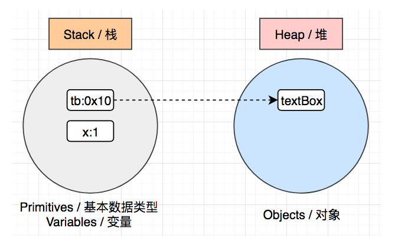

# OOP（面向对象编程）

## 一、介绍

**面向过程编程**：是分析问题解决的过程 ，通过函数把过程一步一步实现，在使用时通过调用相关函数即可。(做一件事，分为多个步骤，每个步骤之间是有序的，最后按序完成）

优点：性能高。

缺点：维护和扩张困难、代码复用性差。

**面向对象编程**：把一个问题拆分成多个小的对象，强调的是通过调用对象的行为来实现功能，而不是自己一步一步的去操作实现。

优点：易维护、易复用、易扩展。

缺点：比于面向过程性能低。

**三大基本特征**：即封装、继承和多态。

## 二、class

### 类与对象

* class(类)：是一组相关**属性**和**行为**的集合。可以看成是一类事物的模板，使用事物的属性特征和行为特征来描述该 类事物。也可以理解为是blueprint（蓝图），是用来创建对象的图纸。

  **属性**：就是该事物的状态信息。

  **行为**：就是该事物能够做什么。

* object(对象)：对象是类的一个**实例**（instance），必然具备该类事物的属性和行为。

### 对象与类的关系

类是对一类事物的描述，是抽象的。

对象是一类事物的实例，是具体的。

类是对象的模板，对象是类的实体。

### 内存分配

* 基本数据类型：存储在栈这个区域
* 引用数据类型：首先计算赋值表达式的右值，也即是对象，将其保存在堆这个区域，并且得到一个内存地址（引用，例如0x10），然后将这个内存地址通过一个变量，也即赋值表达式的左值（例如tb），保存在栈这个区域。tb这个变量通过内存地址引用了保存在内存堆中的一个对象，这就是我们为什么称之为引用类型数据的原因。

> `Java`不同于 `C/C++`，它不需要通过编码释放内存，当我们执行完一个代码块，其中保存在栈区域的变量都会被移除掉。同时，后台还会有一个进程（`Garbage Collection`，简称`GC`，即垃圾回收器），随时监控堆区域，如果堆区域的对象没有被引用，那么它们也会在某个时间点被自动释放掉。

### OOP 原则（封装、抽象、继承、多态）

**封装**：即把数据和操作数据的方法，打包到一个单元或者对象中。把想要隐藏的数据隐藏起来，只暴露想要暴露的数据。

**抽象**：即通过隐藏不必要的细节，来降低复杂度（降低外部调用的复杂度）。就是把一些实现的细节隐藏在类中，而是通过一些接口和方法来对它进行操作即可。

**继承**：即子类继承父类的特征（属性）和行为，使得子类对象（实例）具有父类的属性和方法，或子类从父类继承方法，使得子类具有父类相同的行为。

继承可以使得子类盖父类别的原有属性和方法，使其获得与父类别不同的功能。另外，为子类别追加新的属性和方法也是常见的做法。

* 子类继承父类可以获得父类的功能，提高代码的复用性。
* 子类可以重写（覆盖）某些父类的功能，我们一般称为增强。
* 子类除了可以继承父类的功能之外，还可以额外添加子类独有的功能，一般来说，子类要比父类强大（你的是我的，我的还是我的）。

**多态**：即事物（对象）存在的多种形态，简称多态。多态体现了程序的可扩展性、代码的复用性。